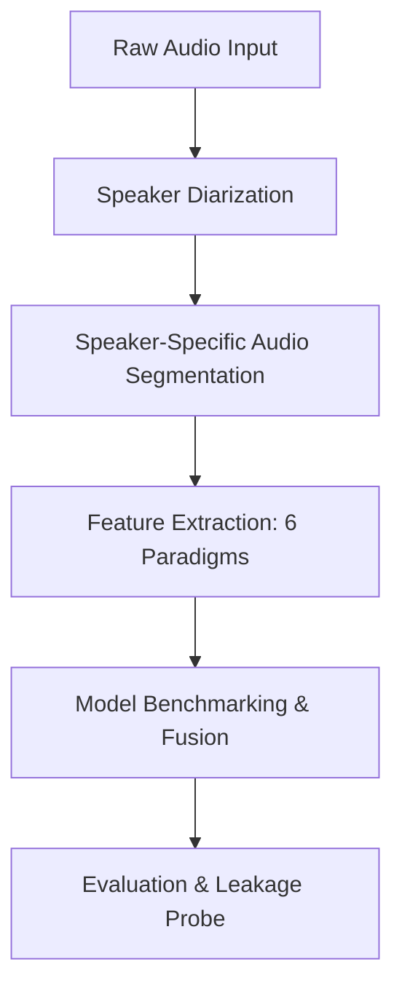

## Project Overview

**ECHO** is an audio-only clinical depression detection system under active development (initiated May 2026, targeting completion by late August 2026). The project evaluates modern self-supervised learning (SSL) speech architectures against traditional handcrafted acoustic features.

By utilizing high-performance computing (HPC) clusters via SLURM, the pipeline conducts heavy feature extraction and modeling on clinical audio datasets like **DAIC-WOZ** and its multimodal predecessor **E-DAIC**.

---

## Technical Architecture

ECHO uses a modular audio-ML pipeline:

### 1. Speaker Diarization
To isolate patient speech from interviewers, we implement `pyannote.audio`-based speaker diarization. This step runs on an HPC environment configured through SLURM. 

From the diarization output, we extract **macro-behavioral timing features** (e.g., speech rate, turn-taking latency, and pauses), which are documented biomarkers for depressive states.

### 2. Six-Paradigm Feature Extraction
We extract representations from six different audio feature spaces to compare traditional hand-engineered features with state-of-the-art SSL features:
* **eGeMAPS / openSMILE**: Standardized physiological acoustic parameters.
* **HuBERT-Large**: Self-supervised speech representation trained on masked prediction.
* **WavLM-Large**: Noise-robust speech modeling, capturing both speech content and background noise properties.
* **emotion2vec+**: Features optimized specifically for vocal emotion recognition.
* **data2vec / Audio-JEPA**: Joint-Embedding Predictive Architecture for self-supervised audio representation.
* **WavLM-CLAP**: Custom contrastive language-audio pretraining head.

We also extract glottal features (using the **COVAREP** toolbox) to model vocal fold vibrations.

---

## Methodological Rigor

ECHO implements a strict validation protocol:
1. **Official Train/Dev Split**: Standard benchmarker splits.
2. **Subject-Disjoint k-Fold Cross-Validation**: Ensuring no samples from the same speaker appear in both training and test sets.
3. **Explicit Speaker-Leakage Probe**: A verification tool designed to verify that model performance is not inflated by learning speaker-specific traits rather than depressive indicators.

---

## Predecessor Work

ECHO builds upon prior research in **Multimodal Depression Detection** on the E-DAIC dataset. That work utilized:
* **WavLM** for speech features.
* **MentalRoBERTa** for clinical transcript embeddings.
* **Cross-Modal Transformers** and a **Gated Multimodal Unit (GMU)** fusion architecture for combined binary classification and PHQ-8 score regression.
* An **eXplainable AI (XAI)** pipeline to interpret multimodal features.

*Status: Published in [CoDIT 2026](https://www.ieee-codit2026.com/event/codit-2026-1/track/session-p-31-ai-and-intelligent-information-systems-43) and accepted in IEEE COINS 2026.*
